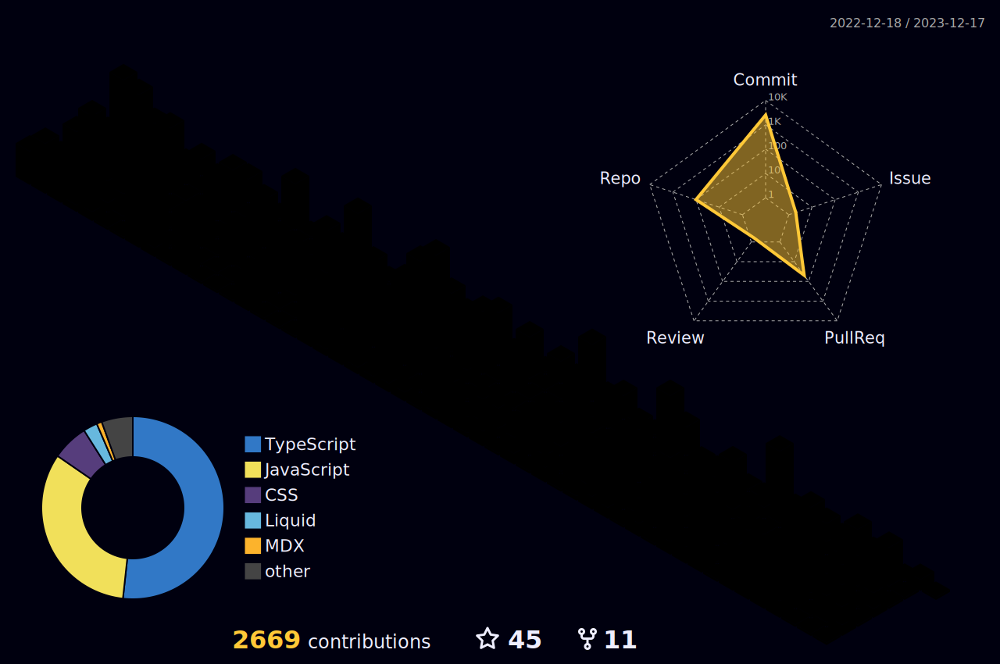

  <h2>🧑🏻‍💻 Working On..</h2>
  <table align="center">
    <thead>
      <tr>
        <th>Title</th>
        <th>Description</th>
        <th>Image</th>
        <th>Links</th>
      </tr>
    </thead>
    <tbody>
      <tr>
        <td>thirdweb-payment</td>
        <td>React component for handling Ethereum payments</td>
        <td>
          
        </td>
        <td>
          
          
        </td>
      </tr>
      <tr>
        <td>thirdweb-marketplace</td>
        <td>Multi collection NFT marketplace</td>
        <td>
          
        </td>
        <td>
          
          
        </td>
      </tr>
      <tr>
        <td>Sheeetsmap</td>
        <td>Sheeetsmap | 2023 Basel ETH Events PWA</td>
        <td>
          
        </td>
        <td>
          
        </td>
      </tr>
      <tr>
        <td>kick.com-api</td>
        <td>Interacting with Kick's API. It includes extensive customization options and supports various API endpoints as well as direct CLI.</td>
        <td>
          
        </td>
        <td>
          
          
          
        </td>
      </tr>
      <tr>
        <td>SocialFeeds</td>
        <td>Create a custom profile where you can link all your social media accounts, websites, and more in one place.</td>
        <td>
          
        </td>
        <td>
          
          
        </td>
      </tr>
    </tbody>
  </table>

<h2 align="center">Github stats :bar_chart:</h2>
<table>
  <tr>
    <td valign="top" width="60%">
      
    </td>
    <td valign="top" width="40%">
      <h2 align="center">🏆 Trophys</h2>
      
    </td>
  </tr>
  <tr>
    <td colspan="6" valign="center">
      
    </td>
  </tr>
</table>

<h2>🛠️ Skills</h2>
<table>
  <tr>
    <th colspan="7" align="center">Favorite Skills</th>
  </tr>
  <tr>
    <td align="center">
      
       Typescript
    </td>
    <td align="center">
      
       Next.js
    </td>
    <td align="center">
      
       Tailwind CSS
    </td>
  </tr>
  <tr>
    <th colspan="7" align="center">Front-end Development</th>
  </tr>
  <tr>
    <td align="center">
      
       Javascript
    </td>
    <td align="center">
      
       React
    </td>
    <td align="center">
      
       HTML
    </td>
    <td align="center">
      
       CSS
    </td>
    <td align="center">
      
       Bootstrap
    </td>
    <td align="center">
      
       JQuery
    </td>
  </tr>
  <tr>
    <th colspan="7" align="center">Back-end Development</th>
  </tr>
  <tr>
    <td align="center">
      
       Node.js
    </td>
    <td align="center">
      
       Express
    </td>
    <td align="center">
      
       Python
    </td>
    <td align="center">
      
       Firebase
    </td>
    <td align="center">
      
       Supabase
    </td>
  </tr>
  <tr>
    <th colspan="7" align="center">Other Skills</th>
  </tr>
  <td align="center">
    
     Solidity
  </td>
  <td align="center">
    
     Discord API
  </td>
  <td align="center">
    
     Twitter API
  </td>
  <td align="center">
    
     Bots
  </td>
  <td align="center">
    
     Vercel
  </td>
  <td align="center">
    
     Netlify
  </td>
  </tr>
</table>

<h2> 🖥️ Workspace Setup</h2>
<table>
  <tr>
    <td>
      
    </td>
    <td>
      
    </td>
  </tr>
  <tr>
    <td>
      
    </td>
    <td>
      
    </td>
  </tr>
  <tr>
    <td>
      
    </td>
    <td>
      
    </td>
  </tr>
  <tr>
    <td>
      
    </td>
    <td>
      
    </td>
  </tr>
</table>
<h4 align="center">Visitor's count :eyes:</h4>

  

